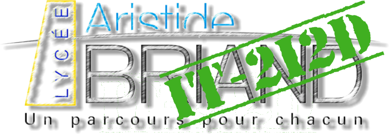

# Pack d'Extension IT-2I2D
Collection  d'extensions pour travailler en IT et 2I2D.

## Description
* Fournis les outils nécessaires pour développer correctement en **Python**. 
* Fournis les outils pour programmer en **html** et **css**.
* Fournis les outils nécessaire pour programmer les cartes **pico pi**
* Facilite le codage avec :
    * Indentation automatique, 
    * Extrait de code, 
    * Amélioration des commentaires (voir exemples ci-dessous),
    * Aperçu de l'exécution du python.
    * Aperçu du résultat html et css en directe.
    * traduction de l'aide contextuelle à la volée
